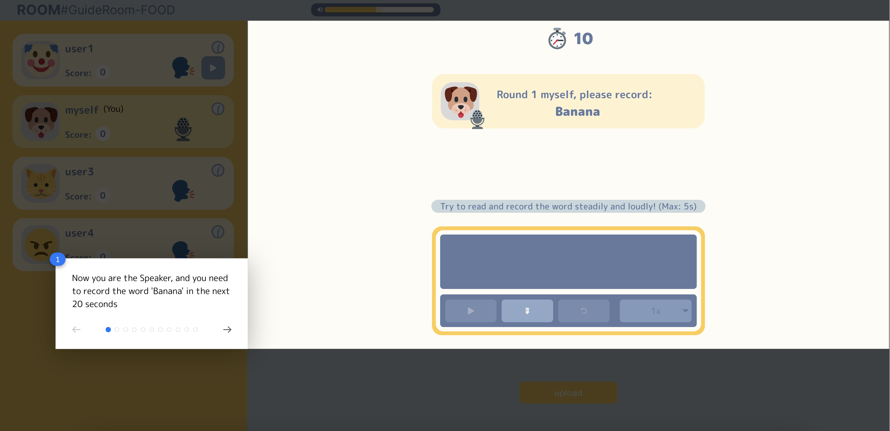
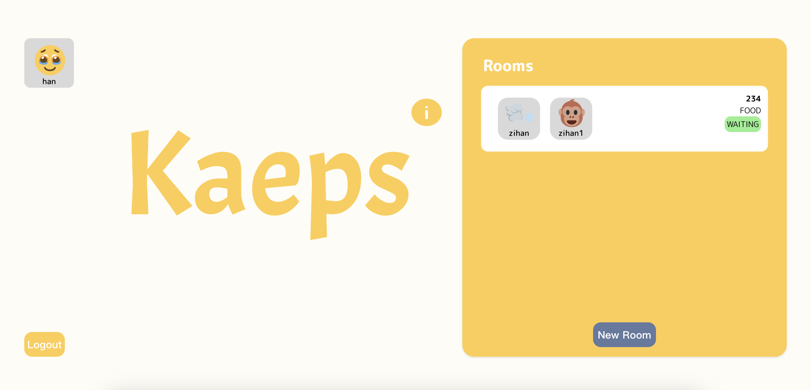
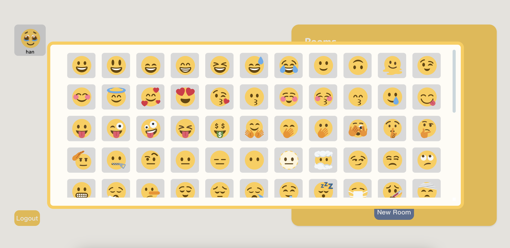
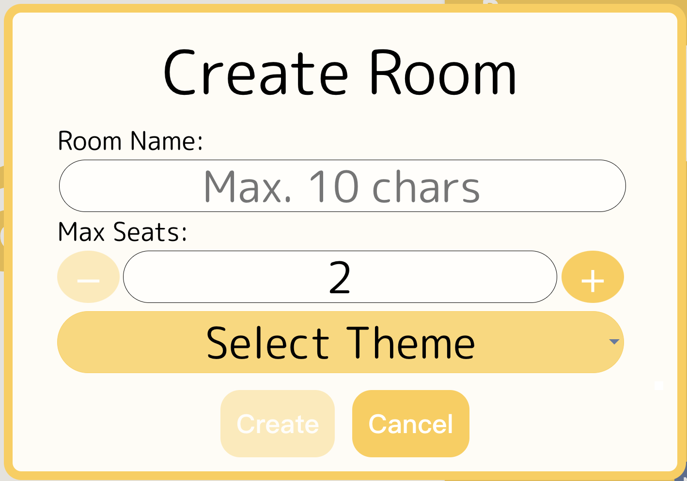
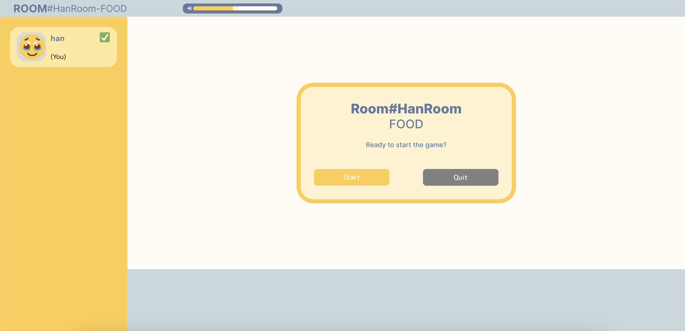
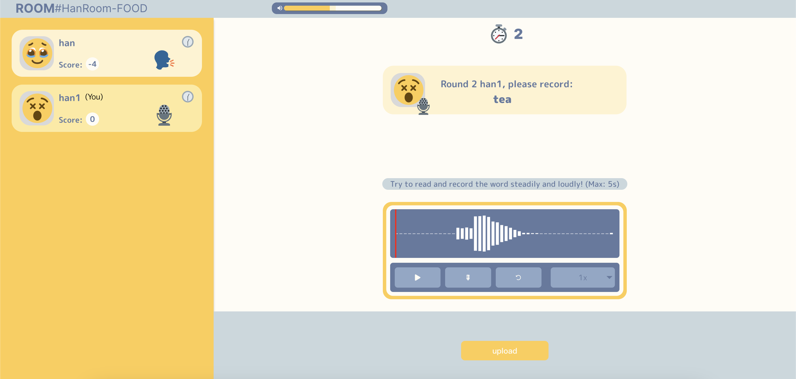
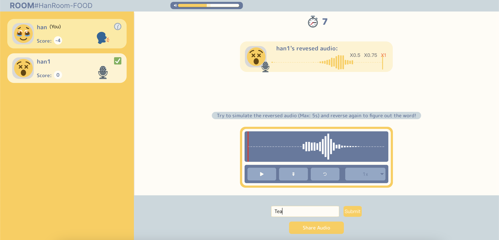
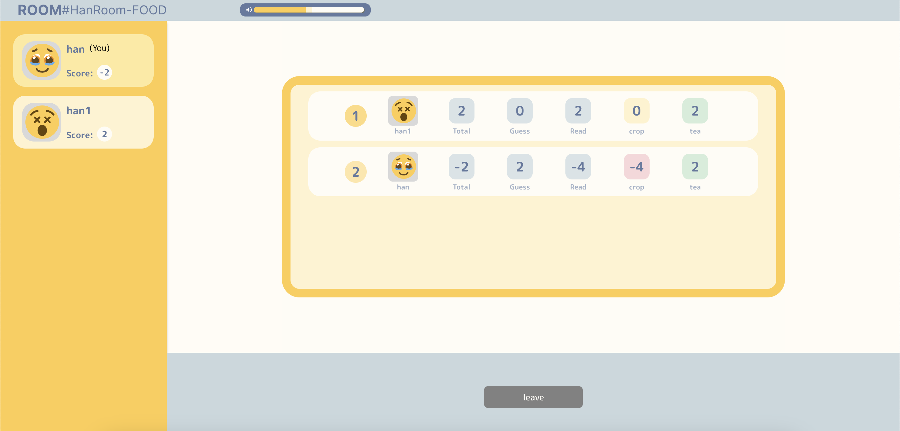

<h1 align="center">SoPra FS24 - KAEPS</h1>
<h2 align="center"> :pencil: Introduction</h2>
"'KAEPS' is a web-based multiplayer game that engages players with a unique auditory challenge. Players take turns retrieving random words or phrases from an API, recording them, and then having the system invert the audio. Guessers must attempt their mimicry and decipher the original word from the second-reversed playback, with the system checking their submitted answer. To realize this game, two core concepts are using a word-distributed API to give a random word and utilizing the Web Audio API to enhance the web apps' capability to process real-time audio efficiently. 'KAEPS' is ideal for web deployment due to its straightforward interface, ease of access without complex installations, and the flexibility to support cross-platform access, showcasing the suitability of web technologies for interactive and engaging online games
<h3 align="center">:round_pushpin: Goal</h3>
The goal of this project is to create an engaging and interactive game that allows players to speak and guess others' reverse audio, while earning points and competing against each other. The project aims to provide a fun and challenging experience that encourages creativity, imagination and quick thinking. The application should be an entertaining and intuitive game that can be easily played and enjoyed by people of all ages and backgrounds.

<h3 align="center">:round_pushpin: Motivation</h3>
The motivation behind a KAEPS is to provide a fun, interactive, and lighthearted activity that can be played with friends, family, or even strangers. The game can be a great way to unwind after a long day, or to simply share a laugh with others. We hope our game can provide a fun and enjoyable experience for all those involved.

## :book: Table of content

- [Technologies](#technologies)
- [High-level components](#high-level-components)
- [Prerequisites & Installation](#prerequisites)
- [Illustration](#illustration)
- [Roadmap](#roadmap)
- [Authors](#authors)
- [Acknowledgment](#acknowledgement)
- [License](#license)
- [Troubleshooting Tips](#tips)

<a name="technologies"></a>
## Technologies

* [React](https://react.dev/) - Frontend JavaScript library developed by facebook
* [STOMP](https://stomp-js.github.io/stomp-websocket/) - Text oriented protocol over WebSocket
* [SockJS](https://github.com/sockjs) - API compatible with WebSocket
* [NPM](https://www.npmjs.com/) - Build automation tool
* [FFmpeg.wasm](https://ffmpegwasm.netlify.app/docs/overview) -  A pure WebAssembly / JavaScript port of FFmpeg enabling powerful and blazing fast audio processing.
* [wavesurfer](https://wavesurfer.xyz/) - Audio visualization library for creating interactive, customizable waveforms.
* [reactour](https://docs.react.tours/) - Interactive tourist guide library.

<a name="high-level-components"></a>
## High level components

### [Gameroom](https://github.com/sopra-fs24-group-09/sopra-fs24-group-09-client/blob/main/src/components/views/Gameroom.tsx)


The Gameroom page is the central interface for gameplay, displaying essential player information (name, avatar, readiness, round status, and score) on the left, based the current round. The top section features room details (name and theme) alongside a volume control for audio adjustments. On the right, a timer counts down each round, complemented by widgets showing current round details and reminders. The bottom-right contains audio recorders supporting recording, playing and reversing, an answer input field, and buttons for uploading/sharing and confirming answer validation. Before and after the game, the bottom-right area will have only the confirm ready pop up or the ranked leader board pop up showing the final result.

### [Lobby](https://github.com/sopra-fs24-group-09/sopra-fs24-group-09-client/blob/main/src/components/views/Lobby.tsx)


The lobby page serves as a navigation hub to various parts of the site. In the top-left, user information (avatar and name) is displayed; clicking here allows access to profile editing. The bottom-left features a logout button, redirecting users to the login/register page. Near the center, an animated info button activates a pop-up with game rules and buttons to activate mic and redirect to the rule guide page. On the right, a list of game rooms shows real-time details (current status, available seats, players, room theme, and name), each clickable to join a game directly from the lobby.

### [RuleGuide](https://github.com/sopra-fs24-group-09/sopra-fs24-group-09-client/blob/main/src/components/views/RuleGuide.tsx)


The Rule Guide page offers a step-by-step walk-through for new players, detailing each stage of a complete game round for both speaking and guessing roles. It features instructional messages and highlighted boxes to indicate necessary actions.

<a name="prerequisites"/></a>
## Prerequisites & Installation

For your local development environment, you will need Node.js.\
We urge you to install the exact version **v20.11.0** which comes with the npm package manager. You can download it [here](https://nodejs.org/download/release/v20.11.0/).\
If you are confused about which download to choose, feel free to use these direct links:

- **MacOS:** [node-v20.11.0.pkg](https://nodejs.org/download/release/v20.11.0/node-v20.11.0.pkg)
- **Windows 32-bit:** [node-v20.11.0-x86.msi](https://nodejs.org/download/release/v20.11.0/node-v20.11.0-x86.msi)
- **Windows 64-bit:** [node-v20.11.0-x64.msi](https://nodejs.org/download/release/v20.11.0/node-v20.11.0-x64.msi)
- **Linux:** [node-v20.11.0.tar.xz](https://nodejs.org/dist/v20.11.0/node-v20.11.0-linux-x64.tar.xz) (use this [installation guide](https://github.com/nodejs/help/wiki/Installation#how-to-install-nodejs-via-binary-archive-on-linux) if you are new to Linux)

If you happen to have a package manager the following commands can be used:

- **Homebrew:** `brew install node@20.11.0`
- **Chocolatey:** `choco install nodejs-lts --version=20.11.0`

After the installation, update the npm package manager to **10.4.0** by running ```npm install -g npm@10.4.0```\
You can ensure the correct version of node and npm by running ```node -v``` and ```npm --version```, which should give you **v20.11.0** and **10.4.0** respectively.\
Before you start your application for the first time, run this command to install all other dependencies, including React:

```npm install```

Next, you can start the app with:

```npm run dev```

Now you can open [http://localhost:3000](http://localhost:3000) to view it in the browser.\
Notice that the page will reload if you make any edits. You will also see any lint errors in the console (use a Chrome-based browser).\
The client will send HTTP requests to the server which can be found [here](https://github.com/HASEL-UZH/sopra-fs24-template-server).\
In order for these requests to work, you need to install and start the server as well.

```npm run lint```

Automatically check an format your code following predefined ESlint rules.

### Testing
Testing is optional, and you can run the tests with `npm run test`\
This launches the test runner in an interactive watch mode.\
See the section about [running tests](https://facebook.github.io/create-react-app/docs/running-tests) for more information.

> For macOS user running into a 'fsevents' error: https://github.com/jest-community/vscode-jest/issues/423

### Build
Finally, `npm run build` builds the app for production to the `build` folder.<br>
It correctly bundles React in production mode and optimizes the build for the best performance:\
The build is minified, and the filenames include hashes.<br>

See the section about [deployment](https://facebook.github.io/create-react-app/docs/deployment) for more information.

<a name="illustration"></a>
## Illustration

### Main User Flow
1. **User Registration and Login:**
    - Users can register with username and password.
    - After registration, users will log in and access the lobby.
   
2. **Beginner's Guide:**
    - For a newly registered user, he/she will go through a beginner's guide to get familiar with the UI and game flow.
      <div style="text-align: center;">
         
      </div>

3. **Lobby:**
    - After Beginner's Guide, users will navigate to lobby where they can see their avatars and usernames on the left-hand side
      and room lists on the right-hand side.
      <div style="text-align: center;">
         
      </div>
    - Users can edit their username and choose a new avatar in profile pop-up
      <div style="text-align: center;">
         
      </div>  
    - Users can create a new room by specifying room settings (e.g. room name, maximum players, game theme).
      <div style="text-align: center;">
         
      </div>
    - Alternatively, users can join an existing room by clicking on the room from the list.

4. **Preparation:**
    - In the room, users can get ready and wait for other players to join.
      <div style="text-align: center;">
         
      </div>
    - The room creator can start the game once players in the room are all ready.

5. **Game Start:**
    - The game starts with one player designated as the **Speaker** and others as the **Challengers**.
    - The **Speaker** receives a word, records it, and sends this audio to the Challengers.
      <div style="text-align: center;">
         
      </div>
    - The **Challengers** listen to the inverted audio sent by the Speaker, mimic the recording and play their recording backwards to guess the original word.
      Then, they submit the original word and can share audio as well. Multiple guesses are allowed before the time runs out.
      <div style="text-align: center;">
         
      </div>

6. **Scoring:**
    - Points are awarded for correctly guessing the word.
    - The faster the guess, the more points are earned.
    - The final score board will be displayed when the game is finished.
      <div style="text-align: center;">
         
      </div>

7. **Rounds:**
    - The game is played in rounds with each round having a different Speaker.
    - Players take turns being the Speaker.


<a name="roadmap"></a>
## Roadmap

- :negative_squared_cross_mark: Implement a live chat feature.
- :negative_squared_cross_mark: Allow to finish each round earlier
- :negative_squared_cross_mark: Configurable setting of game rounds and word difficulty.
- :negative_squared_cross_mark: Optional re-match after a game ends.

<a name="tips"></a>
## Troubleshooting Tips

### Mic Check: 
Ensure your microphone is enabled before starting the game. If your microphone is not accessible, a toast notification will appear to alert you. You can enable microphone access in your browser settings as shown in the images below.

**First time mic access granting:**


**Re-grant the access if blocked before:**


### Time Sync:
Some users may experience issues with an inaccurate counter. To ensure an uninterrupted experience, verify that your computer's clock is set correctly. We depend on the local machine's time to sync game counters and challenges for accurate timing throughout your audio adventure. Most systems will already be synchronized, but if you encounter issues, follow the steps below for manual synchronization:

**For Windows:**


*Image from [Windows Report](https://windowsreport.com/time-synchronization-failed-windows-11/)*

**For macOS:**


*Image from [MacInstruct](https://www.macinstruct.com/tutorials/synchronize-your-macs-clock-with-a-time-server/#:~:text=Here%E2%80%99s%20how%20to%20synchronize%20your%20Mac%E2%80%99s%20clock%20with,the%20time%20server.%20One%20stable%20option%20is%20pool.ntp.org.)*

<a name="authors"></a>
## Authors

| Name          | Personal page                                                                                                                                  |
|---------------| ---------------------------------------------------------------------------------------------------------------------------------------------- |
| Han Yang      | [](https://github.com/Haaaan1)   |
| Shaochang Tan | [](https://github.com/petertheprocess) |
| Yixuan Zhou   | [](https://github.com/yixuan-zhou-uzh)      |
| Zehao Zhang   | [](https://github.com/Zehao-Zhang)     |
| Zihan Liu     | [](https://github.com/zihanltesla)    |

<a name="acknowledgement"></a>
### Acknowledgement

- The client code is based on the [SoPra FS24 - Client Template](https://github.com/HASEL-UZH/sopra-fs24-template-client).
- Many thanks to **[Miro Vannini](https://github.com/mirovv)** who helped us as a Tutor and Scrum Master during this SoPra project.

<a name="license"></a>
## License
We publish the code under the terms of the [Apache 2.0 License](https://github.com/sopra-fs24-group-09/sopra-fs24-group-09-server/blob/main/LICENSE) that allows distribution, modification, and commercial use. This software, however, comes without any warranty or liability.
